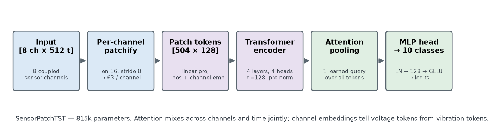
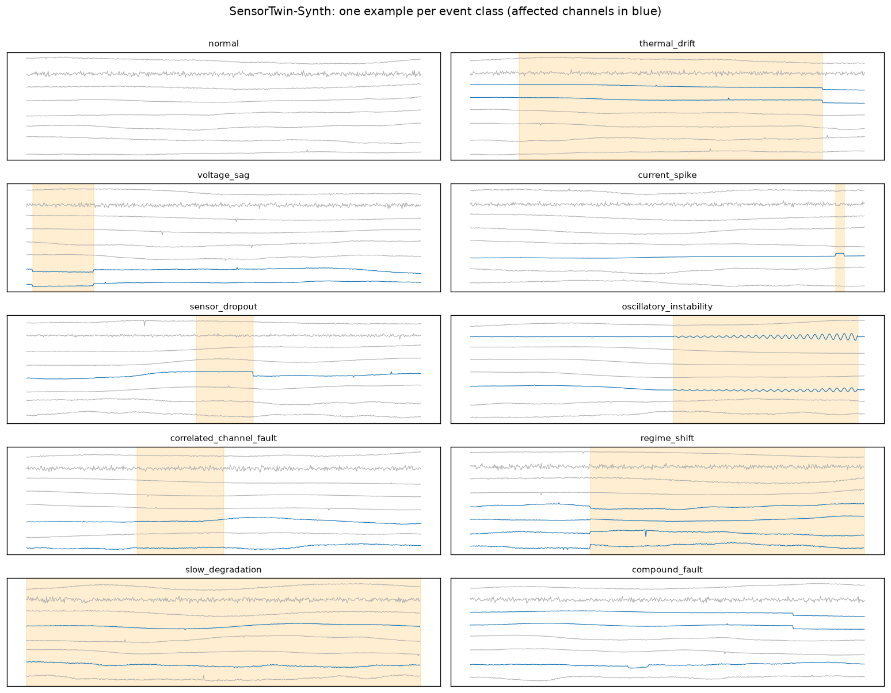
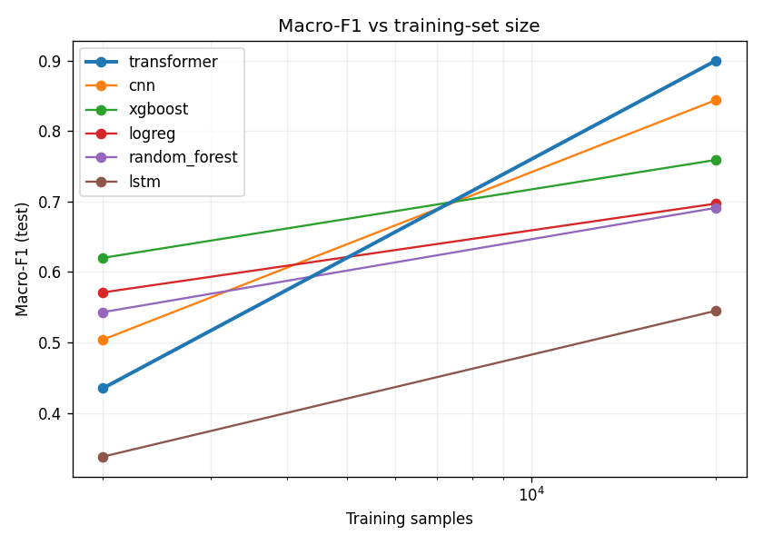
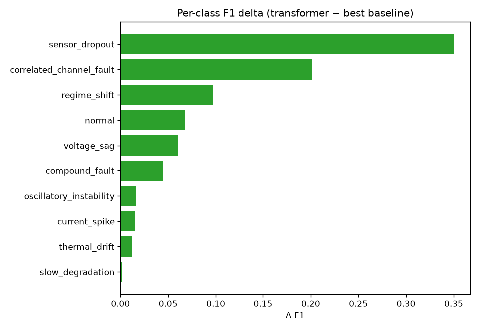
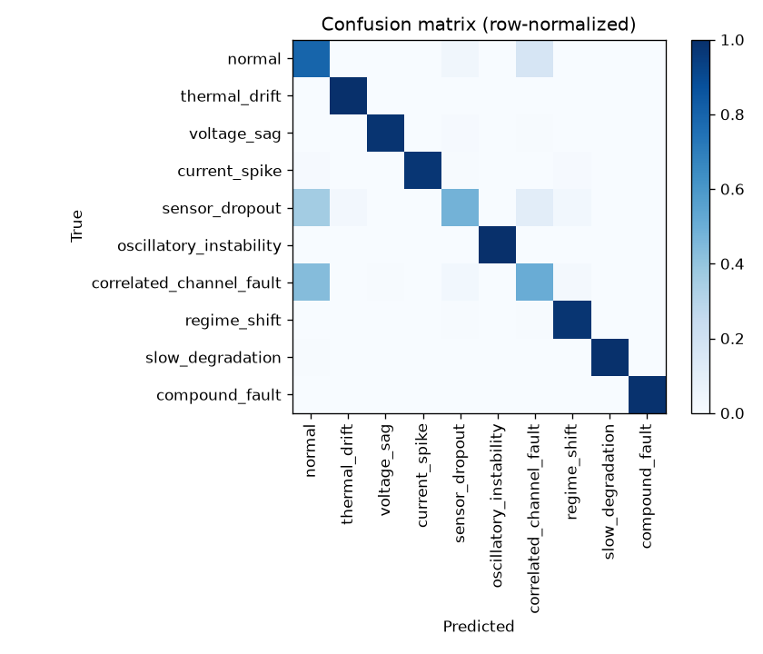
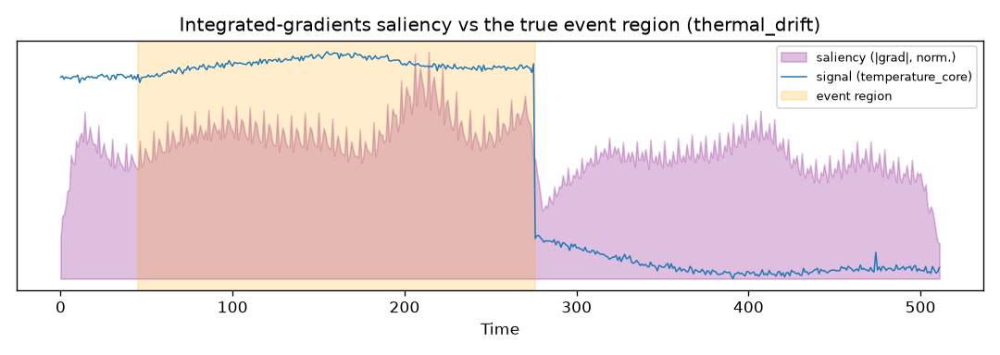

# SensorTwin Transformer Agent

A reproducible, research-style benchmark for **multichannel sensor event classification**:
synthetic physics-inspired data, patch-based transformers, self-supervised pretraining,
robustness/calibration evaluation, and an agentic experiment runner.

> Status: **v0.8.** All three layers are in place: the synthetic benchmark (Layer 1); the
> baseline + evaluation suite (Layer 2); the `SensorPatchTST` patch-transformer + ablations;
> masked-patch pretraining with a label-efficiency sweep; the robustness / calibration /
> interpretability study with a [model card](reports/model_card.md); open-dataset validation on
> NASA C-MAPSS; and the constrained agentic experiment runner (Layer 3). v0.8 re-ran the headline
> under strict **training parity** (every deep model gets the identical recipe) on a **hardened
> generator** (no shortcut channels), with paired statistics over 5 seeds — see the
> [paper-style report](reports/paper_style_report.md) and
> [research log](reports/research_log.md).

## Why this matters

Many scientific and engineering systems emit structured multichannel time-series: voltage,
current, temperature, vibration, telemetry. This project builds a *controllable* benchmark for
learning from such signals. Because we own the data-generating process, we can test specific
hypotheses (does a transformer's inductive bias actually help on cross-channel or long-range events
vs. a CNN or feature baseline?) rather than reward memorizing synthetic artifacts.

The project is built in three layers, **in order** (the agent comes last, on purpose):

1. **Simulation**: synthetic 8-channel generator, 10 event classes, deterministic from a seed.
2. **Modeling**: strong baselines (features, CNN, LSTM) + `SensorPatchTST` + masked pretraining.
3. **Agentic runner**: a *constrained* planner/runner/reviewer loop that orchestrates ablations.

## At a glance

The headline finding and the dataset, in two pictures (regenerate with `python -m scripts.make_figures`):



| The benchmark | The result |
| --- | --- |
|  |  |
| One example per event class (event region shaded, affected channels in blue). | Macro-F1 vs training size, all models on one shared recipe: the transformer **ties the feature baseline at 2k** and **wins decisively at 20k** (+0.09 over the CNN, p=0.001, 5 seeds). |

Where the 20k gain lives (per-class deltas vs the strongest baseline, Holm-corrected), and a
saliency check against the generator's ground truth:

| Per-class gain | Where the errors remain |
| --- | --- |
|  |  |
| Transformer − CNN F1 per class at 20k. The largest gains are the structure/cross-channel classes (`sensor_dropout` +0.35, `correlated_channel_fault` +0.20); trend classes show none. | Trained-transformer test confusion (20k): residual confusion sits exactly on the shortcut-hardened classes, `sensor_dropout` and `correlated_channel_fault` vs `normal`. |



*Integrated-gradients attribution vs the true event span. At trained scale, IG concentrates
~5× chance-level mass on the injected event while attention-pooling weights sit at chance
(0.110 vs random 0.103) — attention ≠ explanation; see the model card.*

## Quickstart

```bash
python -m venv .venv && source .venv/bin/activate
pip install -e ".[dev]"          # core + test tooling; add ".[ml]" for the modeling layer

make test                        # run the suite
make data                        # generate the quick-demo dataset to data/synth_quick_demo.npz
make baselines                   # train + evaluate baselines (needs ".[ml]"), writes the report
make headline-quick              # wiring-grade version of the headline comparison (CPU, minutes)
make headline                    # the real headline: 6 models x 5 seeds at 20k (GPU/MPS, hours)
```

New here? Read the [tutorial guide](docs/tutorial_guide.md); terms are defined in the
[glossary](docs/glossary.md). The full write-up is the
[paper-style report](reports/paper_style_report.md).

Train and evaluate the baselines directly (requires the `ml` extra — `pip install -e ".[ml]"`):

```bash
python -m scripts.train_baseline --mode quick_demo --epochs 10
# -> reports/experiment_summaries/baseline_results.md  (+ metrics JSON/CSV and figures)
```

Generate a dataset directly:

```bash
python -m scripts.generate_synthetic --mode quick_demo          # 2k samples
python -m scripts.generate_synthetic --mode colab_standard \
    --out data/synth_colab                                      # 20k samples
```

Use it in code:

```python
from sensortwin.simulation import generate_dataset, GenConfig
from sensortwin.data import make_split

X, y, meta = generate_dataset(GenConfig(n_samples=2000, T=512, seed=0))   # X: [N, 8, T]
splits = make_split("random", y, meta, seed=0)                            # leakage-checked
```

## Dataset: `SensorTwin-Synth`

Each sample is an 8-channel series composed as
`base_dynamics + load_profile + channel_coupling + event_signature + noise + artifacts`.
Channels are coupled by documented assumptions (voltage anti-correlates with current; core
temperature integrates current through a thermal lag; surface temperature lags core), so some
event classes are detectable *only* through cross-channel relationships.

The 10 event classes span an intentional difficulty gradient: local transients
(`current_spike`), long-range drift (`slow_degradation`), and cross-channel-only faults
(`correlated_channel_fault`). This lets the benchmark discriminate between model inductive biases.

Run modes (spec §19): `quick_demo` (2k), `colab_standard` (20k), `full_reproduction` (100k).

## Results

Both tables come from one committed command (`make headline` →
`python -m scripts.compare_models`), which regenerates the data, resplits, and retrains every
model per seed. **All deep models share one training recipe** (AdamW, weight decay, label
smoothing, cosine warmup, identical augmentation, read from `configs/models/*.yaml`), so the
comparison measures architecture rather than tuning budget. Every number below traces to
[`reports/experiment_summaries/headline_comparison.json`](reports/experiment_summaries/headline_comparison.json),
which records the per-seed values, device, and library versions.

At `colab_standard` (20,000 samples, leakage-safe 70/15/15 split, test set, **5 seeds**,
mean ± sample std):

| Model | Macro-F1 | ECE | Params |
| --- | ---: | ---: | ---: |
| **transformer** | **0.861 ± 0.010** | 0.087 | 815k |
| cnn | 0.774 ± 0.010 | 0.135 | 54k |
| xgboost | 0.704 ± 0.003 | 0.055 | — |
| logreg | 0.649 ± 0.006 | 0.018 | — |
| random_forest | 0.641 ± 0.004 | 0.144 | — |
| lstm | 0.507 ± 0.023 | 0.105 | 39k |

`SensorPatchTST` tops the strongest baseline (the CNN, trained with the identical recipe) by
**+0.09 macro-F1** (95% t-interval [+0.06, +0.11], paired p = 0.001 over 5 seeds,
`evaluation/statistics.py`). Six of ten per-class deltas survive Holm correction, and the two
largest are the classes designed to need temporal structure and cross-channel reasoning:
`sensor_dropout` **+0.35** and `correlated_channel_fault` **+0.20** — the latter is
marginal-preserving by construction, so no single-channel statistic can detect it.

The trend classes show no advantage (`slow_degradation` +0.00, `thermal_drift` +0.01, both
n.s.): features and convolutions already capture monotone drifts. One honest trade-off: the transformer
is the most accurate and among the worst calibrated (ECE 0.087 vs logreg 0.018). A single
temperature fit on validation (T = 0.64 ± 0.01, `make calibration`) cuts its test ECE to
0.016 ± 0.005 with zero predictions changed (3 seeds; see the
[model card](reports/model_card.md)).

**Does the shared recipe favor the transformer? Yes — by a measured amount.** A shared
lr × capacity grid (`make tune`) selects the shared recipe's own cell for the transformer but
stronger cells for the baselines (CNN 211k @ lr 3e-3 → 0.832 ± 0.005). With every model at its
grid optimum the margin narrows to **+0.03** (95% t-interval [+0.03, +0.04], p < 0.001, wins
all 5 seeds), driven almost entirely by `sensor_dropout` (+0.22); the properly sized CNN
recovers most of the cross-channel class. Both protocols are committed
([`tuned/headline_comparison.json`](reports/experiment_summaries/tuned/headline_comparison.json));
quote the tuned number when comparing architectures.

### Small-scale contrast (2k, same protocol, 5 seeds)

| Model | Macro-F1 | ECE |
| --- | ---: | ---: |
| transformer | 0.629 ± 0.032 | 0.077 |
| xgboost | 0.603 ± 0.024 | 0.125 |
| cnn | 0.582 ± 0.028 | 0.142 |
| random_forest | 0.555 ± 0.034 | 0.151 |
| logreg | 0.544 ± 0.028 | 0.140 |
| lstm | 0.384 ± 0.034 | 0.092 |

At 2k the transformer and the feature+GBM baseline are a **statistical tie** (Δ = +0.03,
95% t-interval [−0.02, +0.07], p = 0.16) — and the per-class picture inverts: at 2k the
transformer *loses* `regime_shift` by −0.37 (Holm-significant), the same class it wins by +0.10
at 20k. That sign flip with scale is the benchmark's point: the architecture's advantage on
structural classes exists, and it costs data.

An earlier version of this README reported the transformer far behind at 2k (0.435); that
number came from training the baselines without the transformer's recipe and is superseded (see
the research log entry of 2026-07-02). The §17 ablations (patch size, channel embedding,
pooling) run via `make ablate`.

## Real-data validation (v0.6)

The synthetic numbers above are a controlled testbed, not evidence of real-world performance. v0.6
runs the same pipeline on **NASA C-MAPSS** turbofan data — 14 informative sensors, reframed as
3-stage health classification (healthy / degrading / critical) by binning remaining-useful-life. The
raw files are a US-government work (NASA PCoE) and are not committed; download them and point
`--raw-dir` at the folder:

```bash
python -m scripts.fetch_cmapss --raw-dir /path/to/CMAPSSData --mode quick_demo
python -m scripts.real_data_report --data data/cmapss_FD001 --mode quick_demo   # baselines on real data
python -m scripts.sim2real_transfer --data data/cmapss_FD001 --mode quick_demo  # synthetic->real transfer
```

The split is **grouped by engine** (no engine's windows cross train/test). `sim2real_transfer`
pretrains the masked-patch encoder on synthetic data and transfers the channel-agnostic *temporal*
encoder to C-MAPSS (the 8→14 channel mismatch means the channel embedding is re-learned), against a
real-pretrained upper bound and a from-scratch lower bound.

- **Supported:** the synthetic-data pipeline (windowing, features, model classes, evaluation) runs
  on real sensor data, and models can be ranked on it.
- **Not claimed:** these are not state-of-the-art RUL estimates; the 3-stage binning is a deliberate
  classification reframing, and only the temporal encoder (not channel identity) transfers.

## Agentic experiment runner (v0.7)

A constrained planner → runner → reviewer loop (Layer 3) that automates the experiment workflow — it
is deliberately *not* the novelty. It reads the baseline metrics, proposes one-variable ablations
(each with a hypothesis and an expected failure mode), runs each across seeds, and writes a report.

```bash
python -m scripts.run_agent --epochs 6 --seeds 3 --max-experiments 3   # -> agentic_ablation_report.md
```

Guardrails (spec §13.5) are enforced by Pydantic schemas, not prose: an experiment can't be
constructed with more than one changed variable; `Guardrails.check` rejects out-of-bounds
epochs/modes/dataset sizes; `write_config` refuses to overwrite a committed config or touch `data/`;
and the reviewer calls a variant an **improvement only when the per-seed gain is statistically
significant** (`evaluation/statistics.py`). Every run — including regressions and failures — is
reported, and the agent's *hypotheses* are kept visually separate from the *measured* results. The
planner is deterministic (no API key, runs in CI); an LLM backend is a documented pluggable seam.

## Run on Colab

[](https://colab.research.google.com/github/jman4162/sensortwin-transformer-agent/blob/master/notebooks/03_transformer_training_colab.ipynb)

[`notebooks/03_transformer_training_colab.ipynb`](notebooks/03_transformer_training_colab.ipynb)
installs the package, generates `colab_standard` (20k), and trains `SensorPatchTST` on a GPU. Mixed
precision and a pinned multi-worker DataLoader **switch on automatically when CUDA is detected**; on
CPU the path is unchanged and bit-identical, so tests stay deterministic. Pass `--device` /
`--no-amp` to the training scripts for explicit control.

[](https://colab.research.google.com/github/jman4162/sensortwin-transformer-agent/blob/master/notebooks/04_colab_standard_comparison.ipynb)
&nbsp;[`notebooks/04_colab_standard_comparison.ipynb`](notebooks/04_colab_standard_comparison.ipynb)
runs `scripts/compare_models` (the same command as `make headline`) at `colab_standard` over 5
seeds: mean ± std per model, a paired t-interval/t-test for transformer-vs-best-baseline, and
Holm-corrected per-class deltas. It writes the committable
`headline_comparison.{md,json}` behind the Results section.

## Project principles

- **Reproducible**: every dataset/experiment is deterministic given its seed.
- **Baselines are first-class**: the transformer is only credible measured against strong
  simple models.
- **Beyond accuracy**: macro-F1 (headline), per-class P/R, AUROC, calibration, robustness deltas.
- **Honest**: negative results and failure modes are documented; claims separated from
  speculation.

## Roadmap

| Version | Scope | Status |
| --- | --- | --- |
| v0.1 | Synthetic 8-channel benchmark, splits, tests | **done** |
| v0.2 | Feature + CNN + LSTM baselines, metrics, calibration | **done** |
| v0.3 | `SensorPatchTST` classifier + ablations | **done** |
| v0.4 | Masked-patch pretraining, label-efficiency | **done** |
| v0.5 | Robustness, calibration, interpretability + model card | **done** |
| v0.6 | NASA C-MAPSS open-data adaptation + synthetic→real transfer | **wired, CI-tested on a fixture; not yet run on the real download** |
| v0.7 | Agentic experiment runner + Colab GPU readiness | **done** |
| v0.8 | Fairness overhaul: training parity, hardened generator, paired statistics, 5-seed re-run | **done** |
| v0.9 | Research-grade robustness (both arms), interpretability, calibration, and agent session at 20k, all with committed artifacts | **done** |
| v0.10 | Shared tuning grid + tuned-recipe headline check (the +0.09 → +0.03 decomposition) | **done** |
| next | Matched-budget label-efficiency re-run (Colab notebook 06); C-MAPSS studies on the real download | open |

## License

MIT — see [LICENSE](LICENSE).
